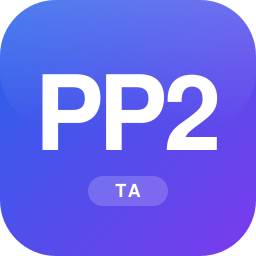

  

<h1 align="center">PP2 TA</h1>

  <i><a href="https://portal.akita-pu.ac.jp/campusweb/slbssbdr.do?value(risyunen)=2025&value(semekikn)=1&value(kougicd)=2025234511&value(crclumcd)=">Python プログラミングⅡ</a> — TA セクション演習</i>

  
  
  

 

<h2 align="center">📅 Schedule</h2>

2026/10 〜 2027/01 ・ 毎週火曜 14:30〜（JST）

| 回 | 日付 | 演習 | 備考 |
| :---: | :---: | :---: | :---: |
| **01** | `10/06` | 📂 [**w01**](./w01_demonstration/) | |
| **02** | `10/13` | — | 🚫 TA不在 |
| **03** | `10/20` | — | |
| **04** | `10/27` | — | |
| **05** | `11/10` | — | |
| **06** | `11/17` | — | |
| **07** | `11/24` | — | 🚫 TA不在 |
| **08** | `12/01` | — | |
| **09** | `12/08` | — | |
| **10** | `12/15` | — | |
| **11** | `12/22` | — | |
| **12** | `01/05` | — | |
| **13** | `01/12` | — | |
| **14** | `01/19` | — | |
| **15** | `01/26` | — | 🎤 成績評価プレゼン |

